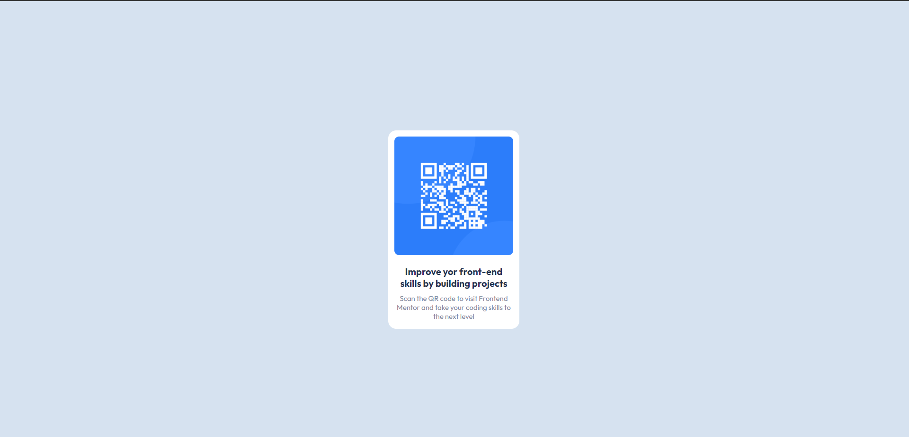
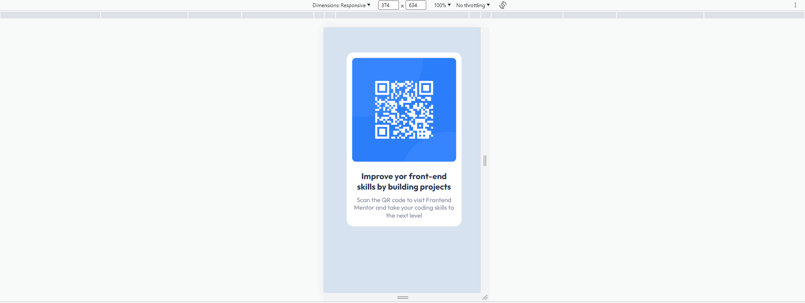

# QR-code-component
This is a solution to the [QR code component challenge on Frontend Mentor](https://www.frontendmentor.io/challenges/qr-code-component-iux_sIO_H).

## Table of contents

- [Overview](#Я выполнила челлендж от Frontend Mentor, в котором предлагалось создать сайт с готовым QR-кодом,используя CSS и HTML)
- [Screenshots] (# , )
- [My process](#Удалось выполнить код быстрее, чем обычно. А также разобраться с импортом шрифтов)
- [Built with](#CSS, HTML)
- [What I learned](#как работать со шрифтамии как функционируют репозитории)
- [Continued development](#буду пробовать челленджы посложнее)
- [Useful resources](#google fonts)
- [Author](#Нежельская Дарья (tired_herb))